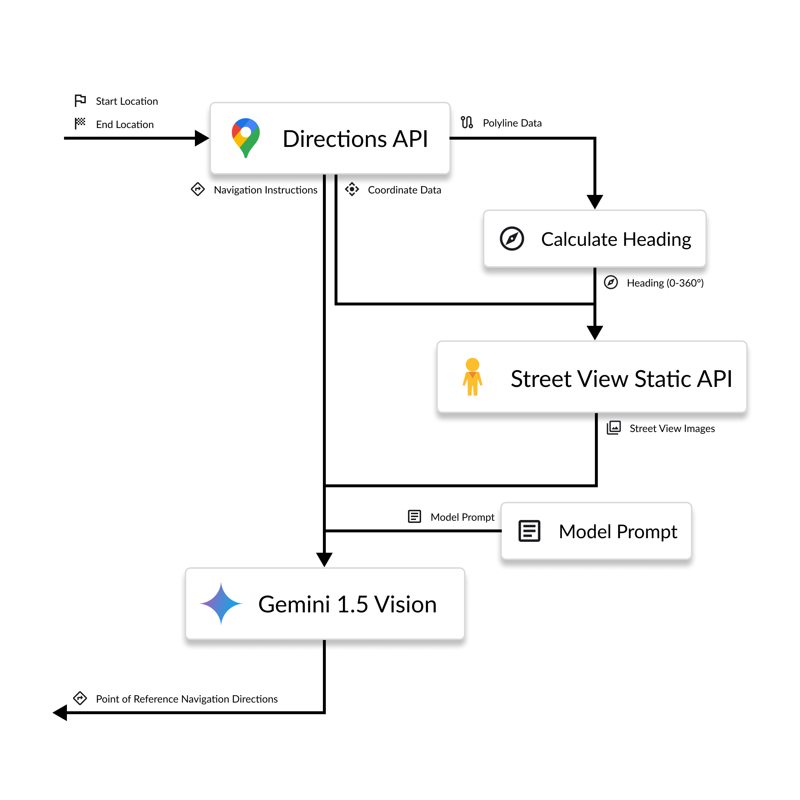
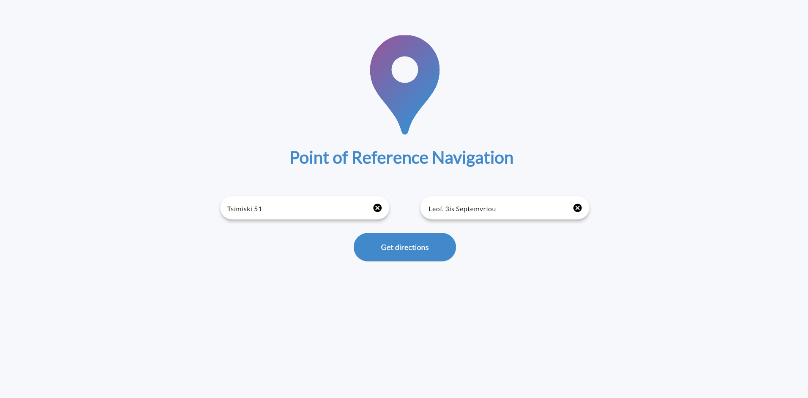
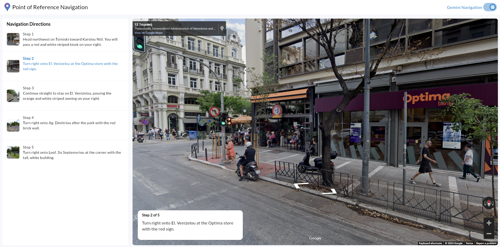

<!--
Hey, thanks for using the awesome-readme-template template.  
If you have any enhancements, then fork this project and create a pull request 
or just open an issue with the label "enhancement".

Don't forget to give this project a star for additional support ;)
Maybe you can mention me or this repo in the acknowledgements too
-->
<div align="center">

  
  <h1>Point of Reference Navigation (aka Visual Directions)</h1>
  
  <p>
    Using Gemini along Google Maps, we can provide navigation directions using points of reference on the street, reducing the need for to glance at the screen while driving.
  </p>
  
  
   
<h4>
    <a href="https://github.com/Louis3797/awesome-readme-template/">View Demo (Coming Soon!)</a>
  </h4>
</div>

<br />

<!-- Table of Contents -->
# Table of Contents

- [Table of Contents](#table-of-contents)
  - [About the Project](#about-the-project)
    - [Screenshots](#screenshots)
    - [Tech Stack](#tech-stack)
  - [Run Locally](#run-locally)
    - [Prerequisites](#prerequisites)
    - [Installation](#installation)
  - [License](#license)
  - [Acknowledgements](#acknowledgements)

  

<!-- About the Project -->
## About the Project

__This is my submission for the [Google AI Hackathon](https://googleai.devpost.com/) at DevPost.__

We all rely on navigation apps like Google Maps to find where we need to go. However, when navigating dense urban environments, the navigation instructions are often insufficient to guide the driver, leading them to take their eyes off the road and glance at the map at their device. 

Professionals such as delivery and taxi drivers and even racing drivers rely heavily on landmarks and points of interest in order to navigate their respective environments. I have personally observed that I make fewer navigational mistakes while driving when I have a friend in the passenger seat interpreting the map and navigation instructions and relating them to visual points of interest in the road. And it is to be expected: The instruction: "Turn right at the next stop sign" is easier to follow than "turn left in 50 meters."

For this project, I wanted to attempt to recreate this using Gemini and Google Maps. Can we provide more intuitive directions to the driver by relating the navigation directions with visible points of reference?

The way the app works is the following: Given an origin and destination points for a route, it fetches the navigation instructions from Google Maps using the Directions API. Next, for each critical point (i.e. when a navigation directions is given) it requests a Street View image from the Street View Static API. The street view images are paired with their respective navigation instructions and passed to Gemini 1.5 for processing. The model returns a new set of directions, which incorporate visual elements from the images. These are usually buildings that stand out due to their size or color, but they may also be statues, flags, signs, trees, parks, bodies of water, antennas, towers, and many other things.

<div align="center"> 
  
</div>


The new augmented navigation directions can be accessed through a Flutter web app.

<!-- Screenshots -->
### Screenshots

<div align="center"> 
  
  
</div>


<!-- TechStack -->
### Tech Stack

<details>
  <summary>Client</summary>
  <ul>
    <li><a href="https://flutter.dev/">Flutter</a></li>
  </ul>
</details>

<details>
  <summary>Server</summary>
  <ul>
    <li><a href="https://www.python.org/">Python</a></li>
    <li><a href="https://firebase.google.com/">Firebase</a></li>
  </ul>
</details>

<details>
  <summary>APIs</summary>
  <ul>
    <li><a href="https://ai.google.dev/">Gemini API</a></li>
    <li><a href="https://developers.google.com/maps/documentation/directions/overview">Directions API</a></li>
    <li><a href="https://developers.google.com/maps/documentation/streetview/overview">Street View Static API</a></li>
    <li><a href="https://developers.google.com/maps/documentation/embed/get-started">Maps Embed API (Frontend)</a></li>

  </ul>
</details>

## Run Locally

<!-- Prerequisites -->
### Prerequisites

In order to run the project locally, you need to have the following installed:
  -  [Flutter](https://docs.flutter.dev/get-started/install)
  -  [Firebase CLI](https://firebase.google.com/docs/cli) (Used by [FlutterFire](https://firebase.flutter.dev/) to connect to the Firebase Cloud Functions)


<!-- Run Locally -->
### Installation

Clone the project

```bash
  git clone https://github.com/ArisChristoforidis/visual-directions.git
```

Go to the project directory

```bash
  cd visual-directions
```

Setup the following environment variables to your system

`DIRECTIONS_API_KEY`: Your Directions API Key

Setup and deploy the [Firebase Cloud Function](https://firebase.google.com/docs/functions) on your backend. The code for the function is provided in the `/backend/` directory. 

The following environment variables need to be setup on your Google Cloud Project:

- `PROJECT_NAME`: The name of your Gemini AI Studio project,which should be connected to your Google Cloud project (e.g. __visual-directions__)
- `PROJECT_LOCATION`: The project location (e.g. __us-central1__)
- `GEMINI_MODEL_NAME`: The name of the Gemini Model you want to use (e.g. __gemini-1.5-pro-preview-0409__)  
- `DIRECTIONS_API_KEY`: Your Directions API Key

Configure FlutterFire on your system

```bash
dart pub global activate flutterfire_cli

flutterfire configure
```

Run the Flutter web app

```bash
  flutter run
```

<!-- License -->
## License

Distributed under the  Apache-2.0 license. See LICENSE.txt for more information.

<!-- Acknowledgments -->
## Acknowledgements

 - [Readme Template](https://github.com/othneildrew/Best-README-Template)
